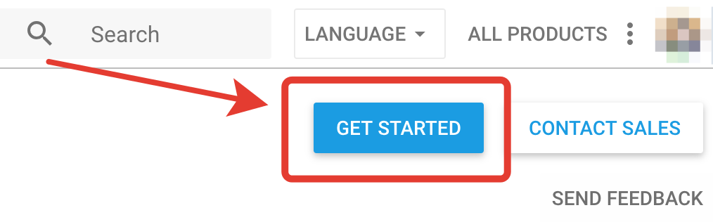
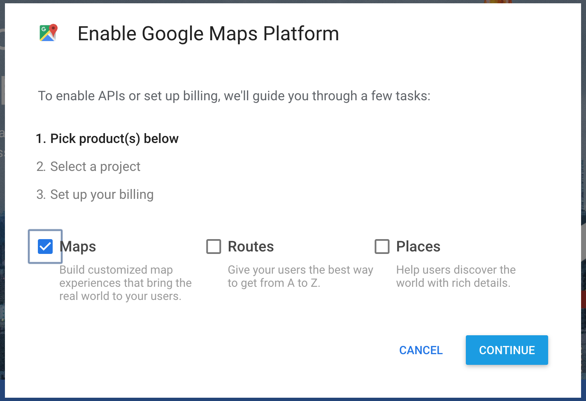
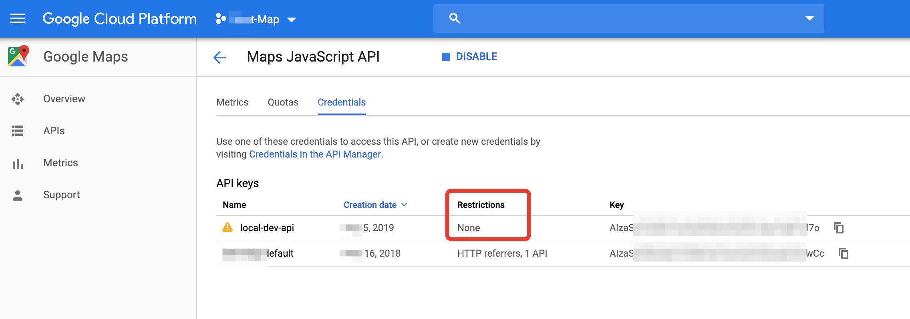
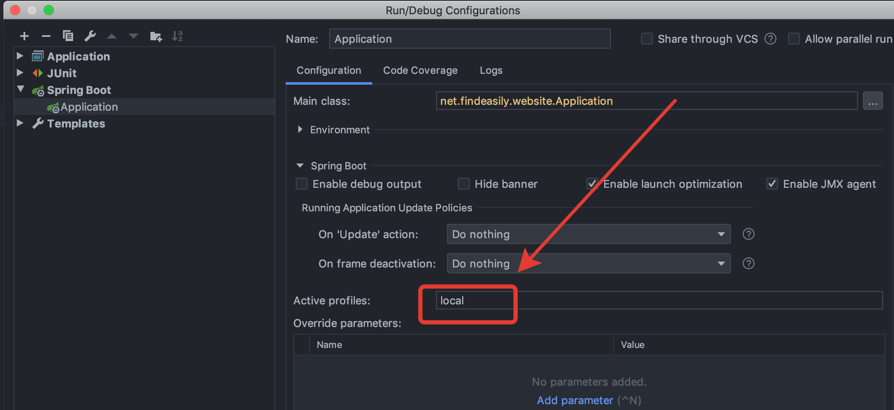

1. Go to [page](https://developers.google.com/maps/documentation/javascript/get-api-key), and click `GET STARTED`.
    
2. Pick "Maps" as product
    
3. Follow the instruction and set up a project & billing info
4. Eventually, you will see page similar to this:
    
5. You can create your own `application-local.properties` in [resource](../src/main/resources) folder, fill the correct info, and add it to [.gitingore](../.gitignore) file.
    
    *NOTE:* The system will only create a test account when active profile is one of [them](../src/main/java/net/findeasily/website/schedule/start/DevProfileStartup.java#L16).
6. Set the your active profile to `local`, then you can run it via Intellij.
    
7. Feel free to contact me via Slack, if you have any questions.    