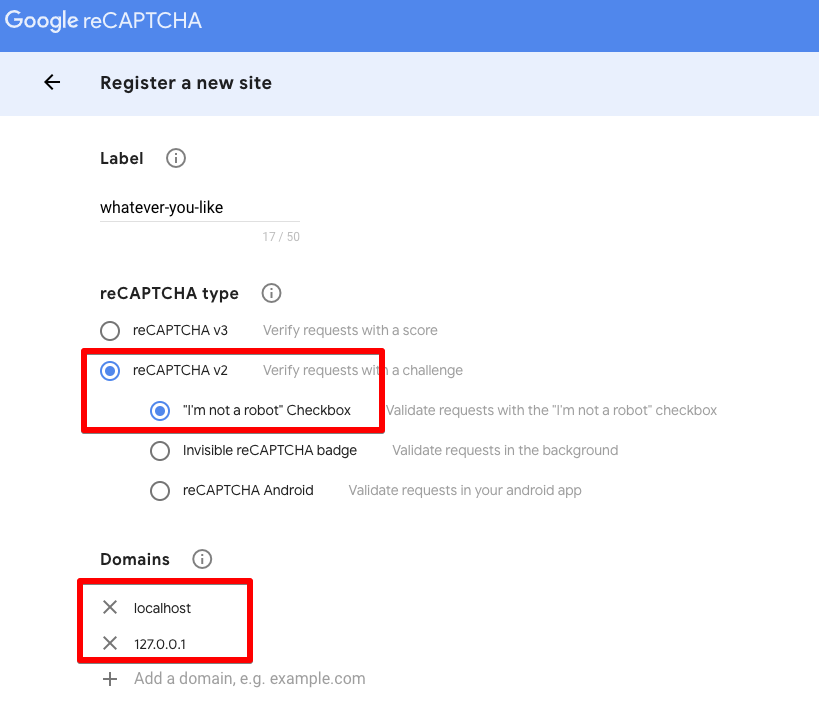
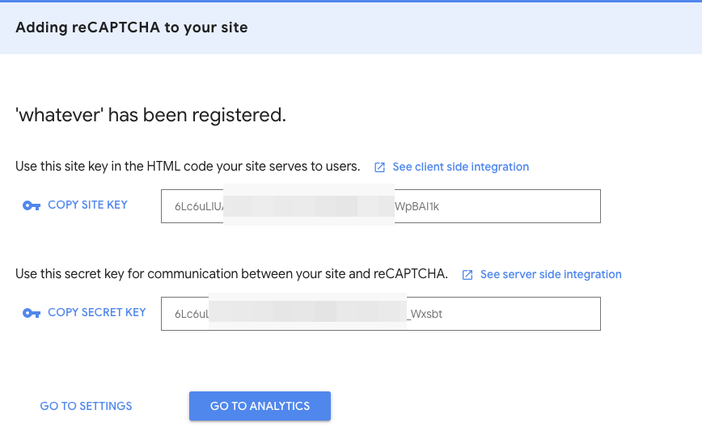

1. Go to https://www.google.com/recaptcha/admin/create
    
2. Click `Submit`, then you will have site-key & secret key:
    
3. Now, you can update your keys in `application-local.properties` file.    
    